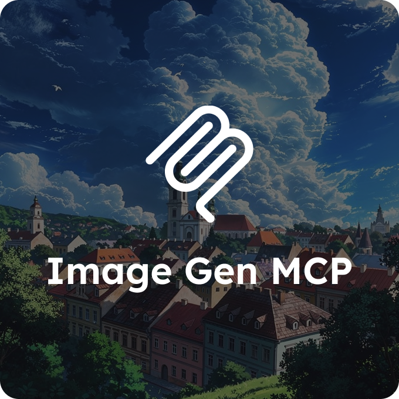

<p align="center">
  
</p>

# Image Gen MCP

A Model Context Protocol (MCP) server that provides AI-powered image generation using Google's Gemini API.

## Features

- **Image Generation**: Generate images from text prompts using Gemini 2.5 Flash Image model
- **Prompting Resources**: Built-in comprehensive prompting guide with examples and templates
- **MCP-Compliant**: Standard MCP server with stdio transport
- **Lightweight**: Docker image for easy deployment

## Prerequisites

- Go 1.24+ (for local development)
- Docker (for containerized deployment)
- Google Gemini API key

## Getting a Gemini API Key

1. Go to [Google AI Studio](https://aistudio.google.com/apikey)
2. Create a new API key
3. Save it for use in configuration

## Installation

### Using Docker (Recommended)

Pull from Docker Hub:

```bash
docker pull vitaliipsl/image-gen-mcp:latest
```

Or build locally:

```bash
docker build -t image-gen-mcp .
```

### From Source

```bash
go build -o bin/image-gen-mcp ./cmd/server
```

## Configuration

The server requires the following environment variables:

| Variable | Required | Description |
|----------|----------|-------------|
| `GEMINI_API_KEY` | Yes | Your Google Gemini API key |
| `OUTPUT_DIR` | No | Directory to save generated images (default: `./generated_images`) |

You can also create a `.env` file in the project root:

```env
GEMINI_API_KEY=your_api_key_here
OUTPUT_DIR=/path/to/output
```

## Usage

### With Claude Desktop

Add the following to your Claude Desktop configuration file:

**macOS**: `~/Library/Application Support/Claude/claude_desktop_config.json`
**Windows**: `%APPDATA%\Claude\claude_desktop_config.json`

#### Using Docker

```json
{
  "mcpServers": {
    "image-gen": {
      "command": "docker",
      "args": [
        "run",
        "-i",
        "--rm",
        "-e", "GEMINI_API_KEY=your_api_key_here",
        "-v", "/path/to/output:/output",
        "vitaliipsl/image-gen-mcp:latest"
      ]
    }
  }
}
```

#### Using Binary

```json
{
  "mcpServers": {
    "image-gen": {
      "command": "/path/to/image-gen-mcp",
      "env": {
        "GEMINI_API_KEY": "your_api_key_here",
        "OUTPUT_DIR": "/path/to/output"
      }
    }
  }
}
```

### With Claude Code

Add via CLI:

```bash
claude mcp add image-gen /path/to/image-gen-mcp \
  -e GEMINI_API_KEY=your_api_key_here \
  -e OUTPUT_DIR=/path/to/output
```

Or add to your Claude Code MCP settings:

```json
{
  "mcpServers": {
    "image-gen": {
      "command": "/path/to/image-gen-mcp",
      "env": {
        "GEMINI_API_KEY": "your_api_key_here",
        "OUTPUT_DIR": "/path/to/output"
      }
    }
  }
}
```

## Available Tools

### generate_image

Generate an image based on a text prompt.

**Parameters:**

| Parameter | Type | Required | Description |
|-----------|------|----------|-------------|
| `prompt` | string | Yes | The text prompt describing the image to generate |
| `aspect_ratio` | string | No | Aspect ratio in `x:y` format (e.g., `16:9`, `1:1`, `4:3`) |

**Output:**

Generated images are saved to the configured `OUTPUT_DIR` and the tool returns the file path(s). This approach is used instead of returning inline base64 data because MCP clients like Claude have response size limits (~1MB), and high-resolution images from Gemini can exceed this limit.

**Example:**

```
Generate an image of a sunset over mountains with aspect ratio 16:9
```

## Available Resources

The server provides comprehensive prompting guides and templates as MCP resources:

| Resource URI | Description |
|-------------|-------------|
| `prompt://guide/prompting` | Complete prompting guide covering core elements, aspect ratios, advanced techniques, photography terms, text rendering, character consistency, and style-specific guidance |
| `prompt://guide/examples` | Curated collection of 25+ example prompts demonstrating best practices across all categories |
| `prompt://templates/list` | Library of 15 ready-to-use prompt templates across photography, illustration, marketing, educational, and professional categories |

### What's Included

**Prompting Guide:**
- Core elements (subject, composition, action, location, style)
- Aspect ratio reference (1:1, 16:9, 9:16, etc.)
- Advanced photography terms and techniques
- Text rendering in images
- Character consistency
- Style-specific guidance

**Template Categories:**
- **Photography**: Photorealistic portraits, landscapes, product photography
- **Illustration**: Character design, stylized art, children's book illustrations
- **Marketing**: Social media posts, product mockups, event posters
- **Educational**: Infographics, technical illustrations
- **Professional**: Architectural visualization, food photography
- **Artistic Styles**: Anime/manga, oil painting
